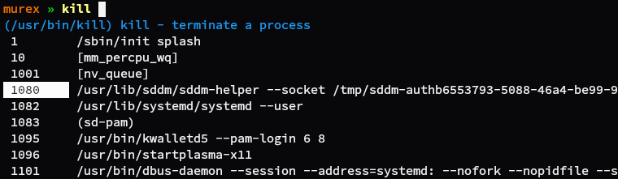

## About _murex_

_murex_ is a shell, like bash / zsh / fish / etc. It follows a similar syntax
to POSIX shells like Bash however supports more advanced features than you'd
typically expect from a $SHELL.

A non-exhaustive list features would include:

* Support for **additional type information in pipelines**, which can be used
  for complex data formats like JSON or tables. Meaning all of your existing
  UNIX tools to work more intelligently and without any additional configuration.

* **Usability improvements** such as in-line spell checking, context sensitive
  hint text that details a commands behavior before you hit return, and
  auto-parsing man pages for auto-completions on commands that don't have auto-completions already defined.
  
* **Smarter handling of errors** and **debugging tools**. For example try/catch
  blocks, line numbers included in error messages, STDOUT highlighted in red
  and script testing and debugging frameworks baked into the language itself.

## Examples

**JSON wrangling:**

**Inline spellchecking**

**Autocomplete descriptions, process IDs accompanied by process names:**

More examples: [/examples](https://github.com/lmorg/murex/tree/master/examples)

## Install instructions

See [INSTALL](INSTALL.md) for details.

## Language Tour

Read the [language tour](docs/GUIDE.quick-start.md) to get started.

## Known bugs / TODO

_murex_ is considered stable, however if you do run into problems then please
raise them on the project's issue tracker: [https://github.com/lmorg/murex/issues](https://github.com/lmorg/murex/issues)
